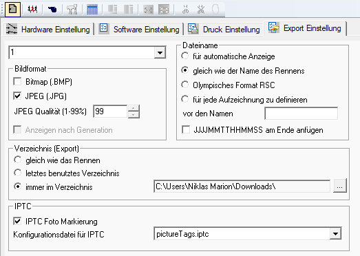
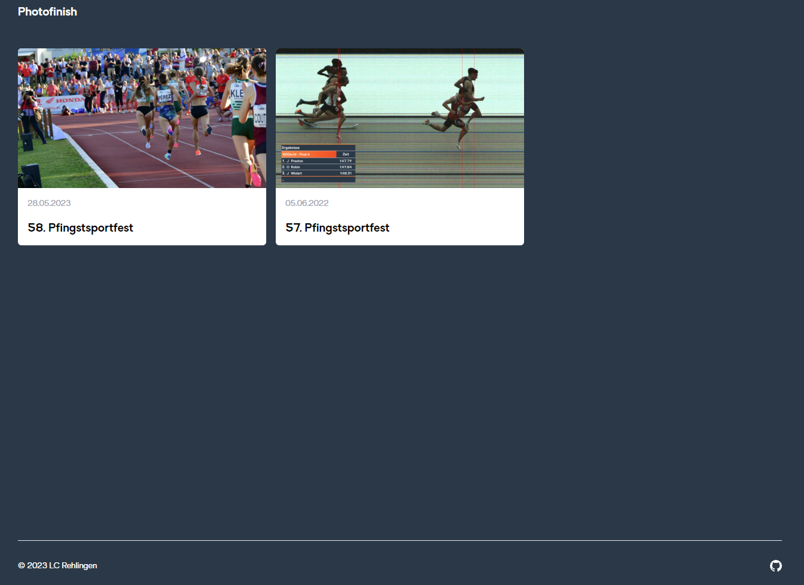

# Photofinish Server

Listet live alle Photofinish übersichtlich auf einer Webseite auf. JPG Dateien werden aus dem Ordner public/images geladen und auf ITPC Daten geprüft welche von der Omega Photofinish Software gesetzt werden können. Für dieses Projekt muss der Laufname in das ObjectName Feld geschrieben werden und die Startzeit in das Headline Feld. Die dafür angepasst Datei [pictureTags.iptc](pictureTags.iptc) muss zur Nutzung in den Ordner C:\OSV-Star\Template gelegt werden.  

Das Verzeichnis für den Export sollte entsprechend angepasst werden damit die Bilder von nextjs gefunden werden können. 

